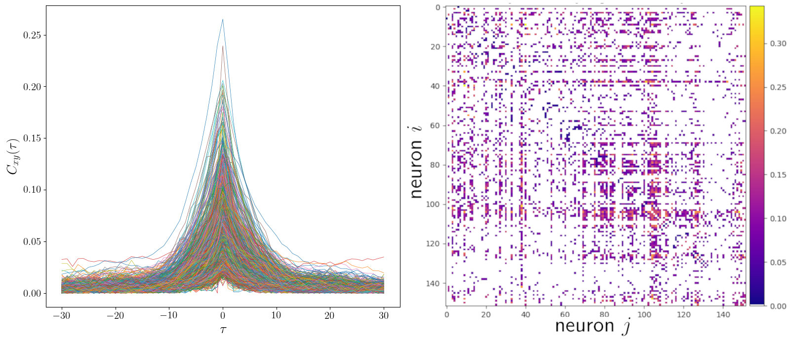
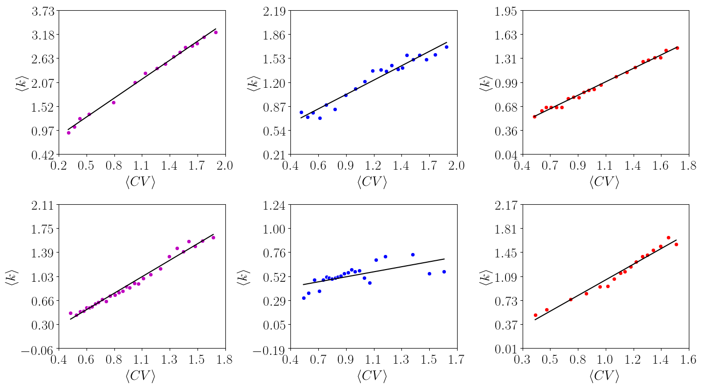
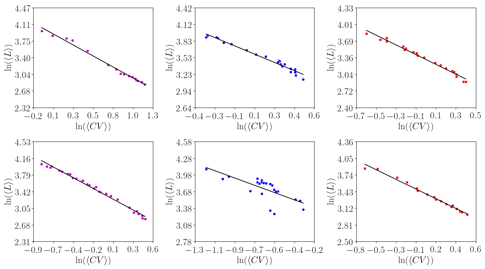
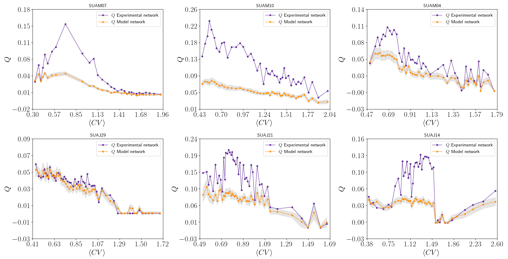
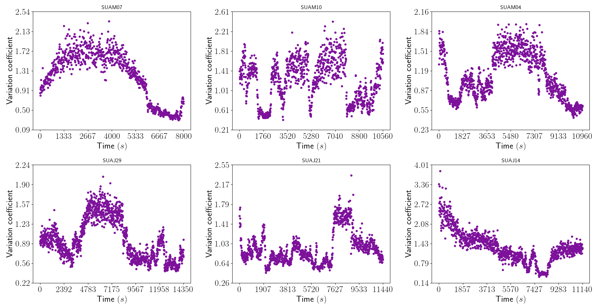
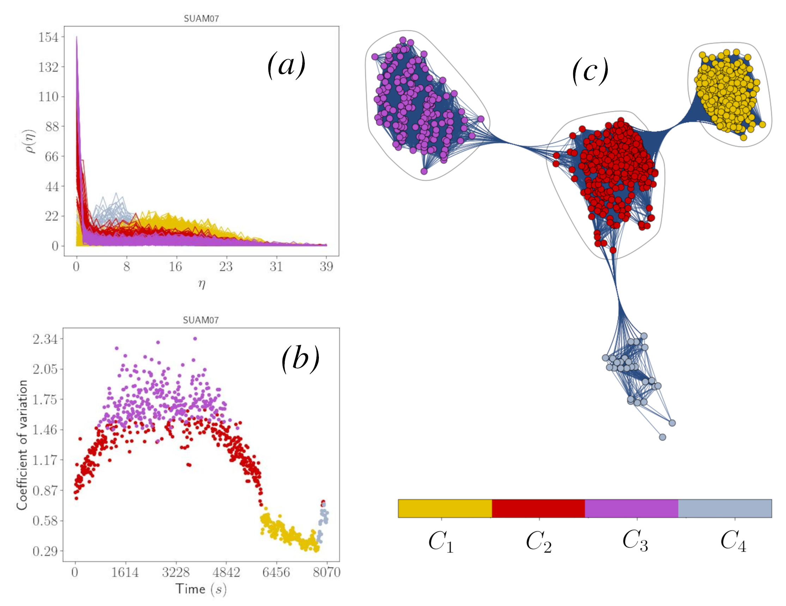
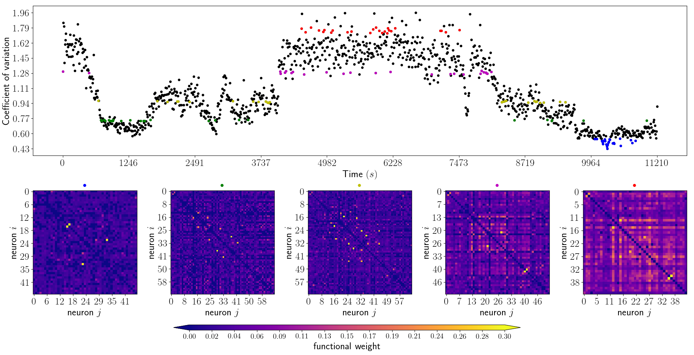
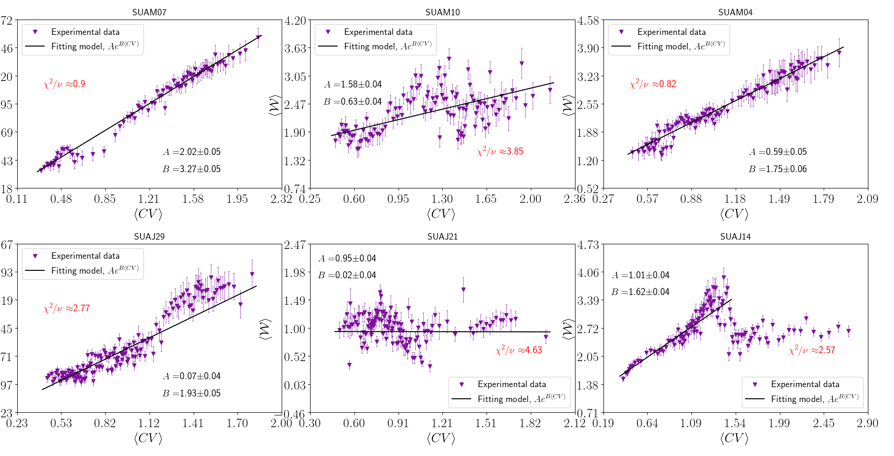
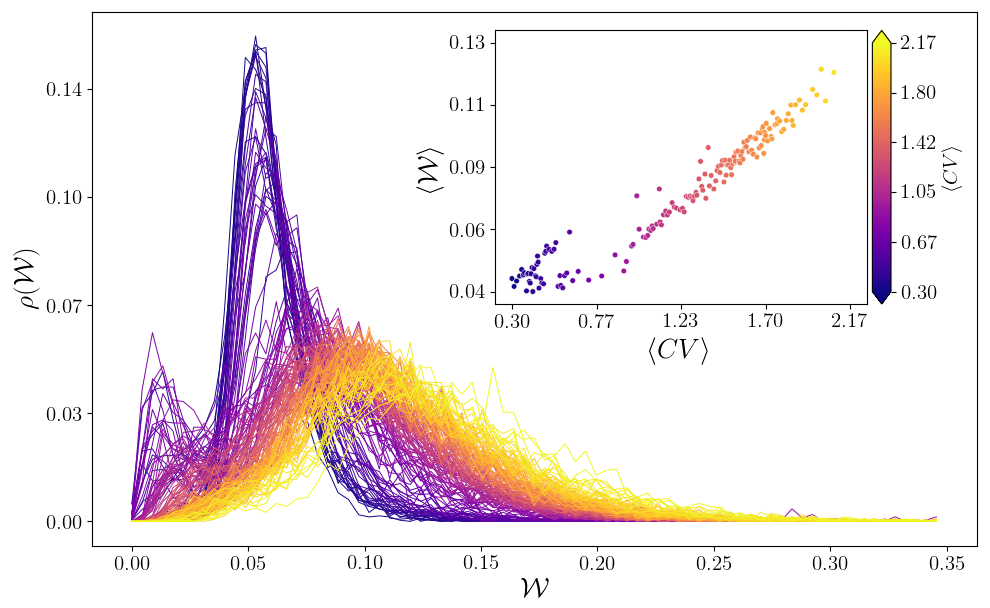

# Estudio de Sistemas Complejos y Análisis de Redes Neuronales

## Descripción
El estudio de sistemas complejos busca comprender el comportamiento emergente a través del análisis detallado de sus componentes e interacciones. Abarcando áreas como el ADN, el funcionamiento cerebral, la dinámica urbana, el clima y la arquitectura de Internet, el análisis de redes —compuesto por nodos y aristas— ha demostrado ser especialmente útil en campos como la neurociencia y las redes sociales.

## Análisis de Redes Funcionales
En este trabajo, se analizan redes funcionales obtenidas por correlaciones cruzadas, donde:
- **Nodos** representan neuronas.
- **Aristas** reflejan las correlaciones entre ellas.

La correlación máxima entre pares de neuronas indica la interacción entre sus patrones de disparo, permitiendo identificar y cuantificar las conexiones neuronales. El análisis funcional abarca:
- Transmisión de señales.
- Propagación de información.
- Evaluación de la eficiencia del sistema.

La teoría de grafos es la herramienta central utilizada para estudiar las relaciones en la red.

## Dispositivos de Registro y Adquisición de Datos
Esta sección proporciona una visión general de los datos experimentales:
- Técnica experimental desarrollada.
- Dispositivos electrónicos utilizados.
- Software empleado.
- Adquisición de datos electrofisiológicos analizados en el Laboratorio de Neurociencia de Sistemas y Computacional (LNSC) de la UFPE.

### Monitoreo Electrofoisiológico
El monitoreo electrofisiológico tiene como objetivo detectar la actividad neuronal en áreas específicas del cerebro, utilizando:
- **Sondas de silicio** para registrar la actividad extracelular.
- **Potenciales de acción (PA)**, impulsos eléctricos generados por la apertura de canales iónicos.

Los datos analizados se recolectaron con una sonda de 64 canales en el córtex visual primario (V1) de ratas anestesiadas. Las señales registradas son amplificadas y filtradas para extraer los potenciales de acción, y algoritmos de clasificación agrupan formas de onda similares.

### Correlación Cruzada
La correlación cruzada mide la relación entre la frecuencia de disparo de neuronas, donde la función de correlación cruzada normalizada está dada por:

$C_{xy}(\tau) = \frac{1}{N_x N_y} \sum_{s=1}^{N_x} x(t) y(t - \tau)$

Los valores de $\(C_{xy}(\tau)\)$ varían entre [0, 1], indicando independencia o sincronicidad entre neuronas.

## Matriz de Conectividad
La conectividad funcional se define por la coincidencia temporal entre actividades neuronales. La matriz de conectividad \(M\) es una matriz bidimensional que describe las interacciones entre pares de neuronas.
 

### Definición de Límite
Las matrices de conectividad pueden estar inicialmente totalmente conectadas, incluyendo tanto correlaciones verdaderas como espurias. Las dos técnicas para definir límites incluyen:
1. **Límite Rígido**: Un límite fijo que mantiene conexiones significativas.
2. **Límite con Datos Surrogados**: Generación de datos surrogados para evaluar la significancia de las correlaciones.

La técnica de "Spike Time Dithering" es un enfoque específico utilizado para este análisis.

## Conclusión
Este estudio analiza datos corticales de ratas anestesiadas con uretana, centrándose en la región visual V1 y utilizando diversos lenguajes de programación para optimizar el rendimiento computacional. Se observa que las métricas de red, como el grado medio y la eficiencia, varían en función del coeficiente de variación, destacando la métrica ⟨𝐿⟩, que muestra tendencias lineales que se cruzan cerca del punto crítico identificado en investigaciones anteriores. La variabilidad incontrolable en las redes complica el análisis y puede introducir sesgos en los resultados. El estudio subraya la importancia de detectar patrones en las series temporales y sugiere que futuras investigaciones deberían mantener constante el número de nodos o el grado medio para mejorar la estabilidad de los resultados.
|                                        |                                        |
|----------------------------------------|----------------------------------------|
|  |  |
|  |  |
|  |  |
|  |  |
|  |  |
|  |  |
